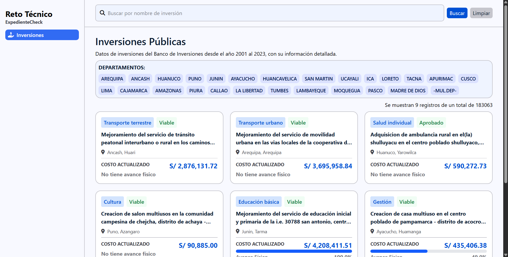
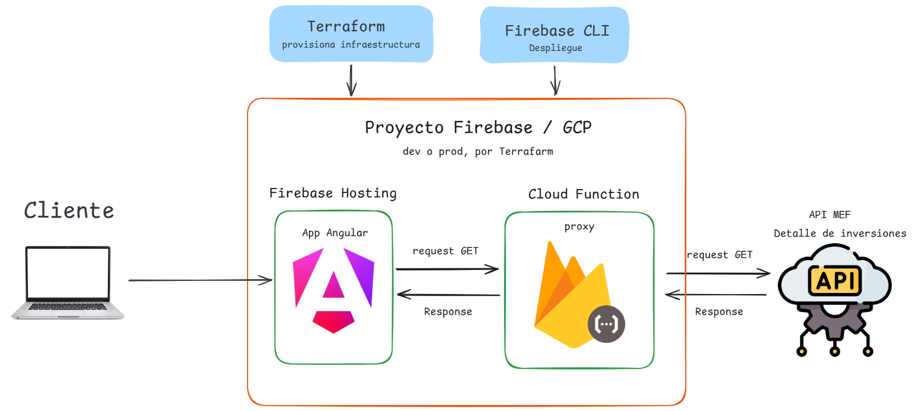

# Reto Tecnico ExpedienteCheck

Aplicación Angular que consume el dataset público **["Detalle de inversiones"](https://datosabiertos.mef.gob.pe/dataset/detalle-de-inversiones)** de Datos Abiertos del MEF mostrando cada inversión por tarjeta, incluyendo datos como el programa, situación, nombre inversión, departamento, provincia, costo actualizado y porcentaje físico en caso tenga. Esta desplegada en Firebase Hosting, con un proxy (Cloud Function) para resolver el problema de CORS, e infraestructura provisionada con Terraform en dos ambientes (dev/prod).

- **URL pública (dev) (versión producto final):** https://mef-inversiones-mrdevv-dev.web.app/
- **URL pública (prod):** https://mef-inversiones-mrdevv-prod.web.app/

## Aplicación final


## Arquitectura de sistema


## Stack tecnológico

| Capa | Tecnología |
|---|---|
| UI | Stitch - Diseño con IA y Figma |
| Frontend | Angular 21 (standalone, signals) |
| Backend/proxy | Firebase Cloud Functions |
| Hosting | Firebase Hosting |
| Infraestructura | Terraform (dev/prod) |
| Estilos | Tailwind CSS |

## Estructura del repositorio

```
.
├── src/                          # Aplicación Angular
│   └── environments/
│       ├── environment.ts             # producción (apunta a la Cloud Function real)
│       └── environment.development.ts # desarrollo (apunta al emulador local)
├── functions/                    # Cloud Function (proxy hacia la API del MEF)
│   └── src/index.ts
├── infra/                        # Infraestructura como código
│   ├── modules/
│   │   └── firebase-app/         # Módulo reutilizable: proyecto GCP + Firebase
│   └── environments/
│       ├── dev/
│       │   ├── main.tf
│       │   └── terraform.tfvars       # no versionado, ver .tfvars.example
│       └── prod/
│           ├── main.tf
│           └── terraform.tfvars       # no versionado, ver .tfvars.example
├── firebase.json
├── .firebaserc
└── angular.json
```

## Prerrequisitos

- [Node.js](https://nodejs.org/) 18 o superior
- [Angular CLI](https://angular.dev/tools/cli): `npm install -g @angular/cli`
- [Firebase CLI](https://firebase.google.com/docs/cli): `npm install -g firebase-tools`
- [Google Cloud CLI](https://cloud.google.com/sdk/docs/install) se puede instalar mediante su instalador
- [Terraform](https://developer.hashicorp.com/terraform/install) se descarga un .zip y se tiene que agregar a las variables de entorno de windows.
- Una cuenta de Google con **facturación activa** (plan Blaze) — necesaria para Cloud Functions.

---

## Correr el proyecto en local

### 1. Clona e instala dependencias

```bash
git clone https://github.com/MrDevv/reto-tecnico-expediente-check
cd reto-tecnico-expediente-check
npm install
cd functions
npm install
cd ..
```

### 2. Autentícate

```bash
gcloud auth login
gcloud auth application-default login
```

### 3. Levanta el emulador de Functions (terminal 1)

```bash
firebase emulators:start --only functions
```

Copia la URL que te muestre (`http://127.0.0.1:5001/<project-id>/us-central1/mefProxy`) y verifica que coincide con `apiURL` en `src/environments/environment.development.ts` o reemplazala. Esta URL hará referencia a la cloud function para poder consumir la API del MEF.

### 4. Levanta Angular (terminal 2)

```bash
ng serve
```

Abre `http://localhost:4200`.

---

## Aprovisionar infraestructura con Terraform

La infraestructura (proyecto GCP, APIs habilitadas, registro de Firebase, sitio de Hosting) se crea con **Terraform** 

### 1. Obtén tu Billing Account ID

```bash
gcloud billing accounts list
```

### 2. Configura las variables del ambiente

##### Ya sea para configurar el ambiente de dev o prod dentro de `infra/dev` o `infra/prod`, para este ejemplo haremos el de dev.

Crea una copia del archivo de ejemplo `terraform.tfvars.example` y elimina la palabra example de manera que quede como `terraform.tfvars`.

Posteriomente modificas las propiedades de `project_id`, `project_name` y `billing_account`.

```hcl
project_id      = "tu-project-id-dev"   # debe ser único globalmente
project_name    = "MEF Inversiones Dev"
region          = "us-central1"
billing_account = "XXXXXX-XXXXXX-XXXXXX" #colocar el ID que se consiguió en el paso anterior
```
### 3. Aplica

```bash
cd infra/environments/dev
terraform init
terraform plan
terraform apply
```

Puede repetir el mismo proceso para el ambiente de producción `infra/environments/prod`, pero colocando un `project_id` distinto para el ambiente.

### 4. Conecta el CLI de Firebase al proyecto creado

```bash
firebase use --add
# selecciona el project_id que generó Terraform, asígnale el alias "dev" (o "prod")
```

---

## Desplegar a Firebase

El **contenido** (build de Angular + código de la función) se despliega con el CLI de Firebase.

```bash
ng build
firebase deploy --only hosting,functions
```

Al terminar, copia la URL de la función (`Function URL (mefProxy)`) y actualiza `src/environments/environment.ts` con esa URL real antes de volver a desplegar el hosting:

```bash
ng build
firebase deploy --only hosting
```

Al finalizar copia la URL que se genera y pruebala en el navegador.

---

## Decisiones que tomé

**Angular y Tailwind como frontend.** Decidí crear el frontend con angular 21 y Tailwind, para agilizar el desarrollo de esta capa, permitiendo enfocarme en las herramientas de Firebase y Terraform.

**Cloud Function como proxy.** Al momento de consumir la API del MEF tuve el problema de CORS por lo que decidí usar Cloud Function de Firebase como proxy, permitiendome solucionar este problema.

**Módulo Terraform + carpeta por ambiente, en vez de *workspaces*.** Los *workspaces* comparten el mismo backend de estado y solo cambian un sufijo interno — es fácil aplicar el ambiente equivocado por error si se olvida seleccionar el workspace correcto. Con carpetas físicamente separadas (`infra/environments/dev` y `infra/environments/prod`), cada ambiente tiene su propio estado aislado y es imposible confundirlos, ya que literalmente se trabaja desde una carpeta distinta. El módulo (`infra/modules/firebase-app`) evita duplicar la definición de recursos entre ambientes.

**Separación entre "crear infraestructura" y "desplegar contenido".** Terraform provisiona el proyecto GCP y los recursos de Firebase. El contenido real de la aplicación (build de Angular, código de la función) se despliega con `firebase deploy`.

---

## Qué tuve que aprender desde cero

- No había trabajado con Firebase ni con proxies para consumir APIs externas, tuve el problema de CORS pero con APIs que yo había creado, por lo que lo solucionaba mediante una configuración en mi backend. Aprendí a crear una cloud function con Firebase y usarlo desde mi aplicación Angular para poder obtener los datos de la API del MEF.

- Instalación y configuración Google Cloud CLI y Terraform en Windows (variables de entorno / PATH), nunca los había usado.

- Aprendí a separar la configuración de terraform por ambientes (dev/prod) por modulos y variables en su respectivo ambiente.

- Desplegar una aplicación en Firebase Hosting